# pdf-translate-zh

**把英文工业技术 PDF 变成可直接交付的中文 PDF。**
说明书、技术规范、工程图纸、表单、PPT 讲义都能处理：按中文习惯排版，图纸线条不动，图里的字也翻，出稿前自动检查。

[](https://github.com/ldfpku/pdf-translate-zh/actions/workflows/ci.yml)
[](LICENSE)

适用于 Claude Code、Claude.ai / Claude 桌面版，以及 Codex、Cursor、GitHub Copilot、Gemini CLI、Google Antigravity、OpenCode、Windsurf 等支持 [Agent Skills](https://agentskills.io) 标准的 AI 工具。

> English: an Agent Skill that turns English industrial / oil & gas / mechanical engineering PDFs (manuals, specs, drawings, forms, slide handouts) into publication-grade Simplified Chinese PDFs — reflowed Chinese layout, drawings translated in place, text inside figures translated, TOC links and bookmarks, and automatic QA checks before output. Windows, macOS and Linux; dependencies and fonts are set up on first run.

> [!CAUTION]
> **数据合规声明｜使用前必读**
>
> - **排版在本机完成，不上传文档。** 联网只用于首次下载依赖和可选的插图放大模型。
> - **翻译由你的 AI 工具背后的大模型完成。** 使用云端模型（Claude、GPT、Gemini、DeepSeek 等在线服务）时，原文与译稿会发给该服务商。
> - 处理保密、出口管制、含个人信息等受监管文件前，**请自行确认**符合当地法律法规（如中国《数据安全法》《个人信息保护法》及数据出境规定、欧盟 GDPR、美国 EAR/ITAR）、合同义务与单位制度。
> - **敏感文档请用本地模型翻译**，原文与译稿不出本机或内网，见 [本地模型方案](#本地模型方案敏感文档推荐)。
> - 本项目按 Apache-2.0 以「现状」提供，作者不对使用者处理数据的合规性承担责任；本声明不构成法律意见。
>
> **Data compliance:** layout runs locally and never uploads documents, but the *translation* is done by whatever LLM powers your AI tool — with a cloud model, source and translation are sent to that provider. Check your laws, contracts and company policy first; use a local model for sensitive documents. Provided "AS IS"; not legal advice.

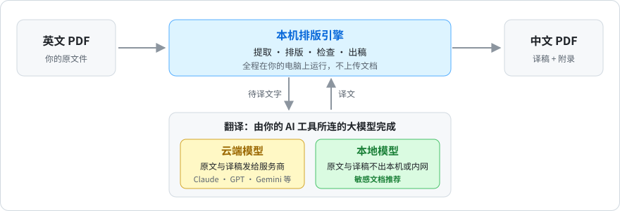

## 解决哪些痛点

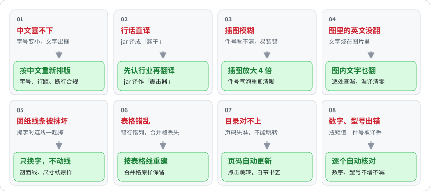

## 效果展示

同一件**虚构**产品（Tethys Downhole Tools 为虚构品牌）的两份文档：装配作业指导书与总装图。样例专挑真实翻译里最难的情况——模糊插图、发虚的件号、图里的英文、多级目录、图纸符号和合并表格。自动检查全部通过。

### 装配作业指导书：重新排版

📄 原文 [SWI-650-SS_Assembly_en.pdf](docs/showcase/SWI-650-SS_Assembly_en.pdf) · 译稿 [SWI-650-SS_Assembly_zh.pdf](docs/showcase/SWI-650-SS_Assembly_zh.pdf) · 复现步骤 [examples/showcase-swi](examples/showcase-swi/)

**整页按中文重新排版，不硬塞回英文框**

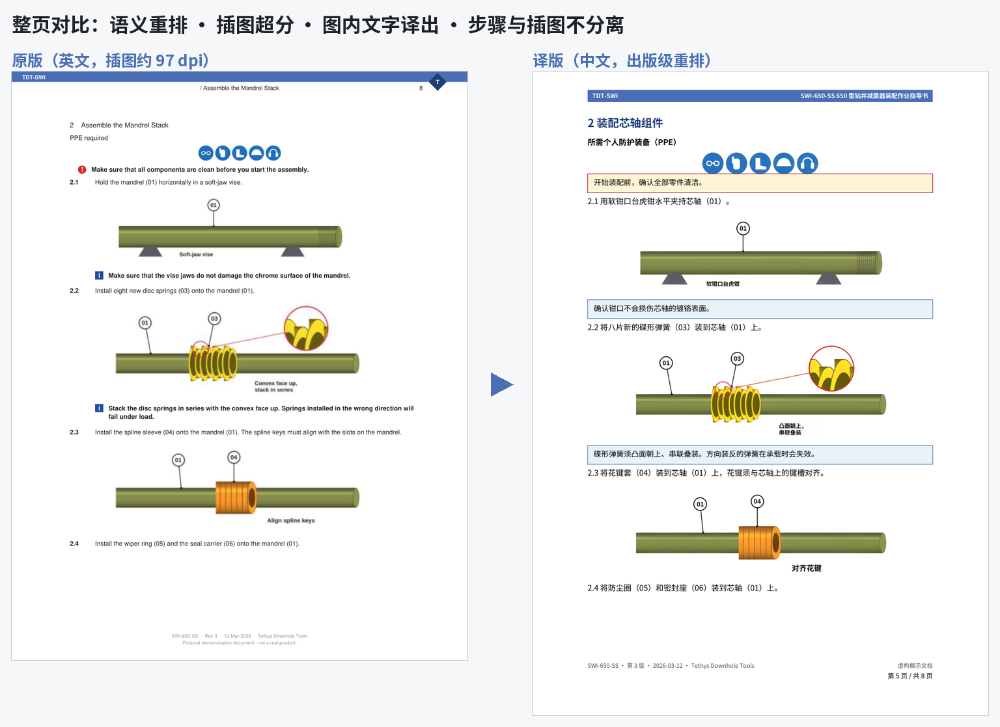

**模糊插图放大 4 倍；件号气泡核对零件表后重画**

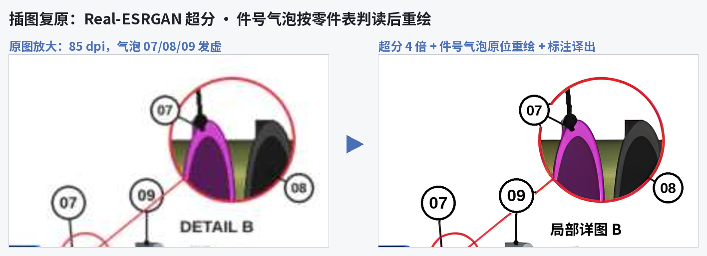

**图里的英文标注换成中文，逐处查漏**

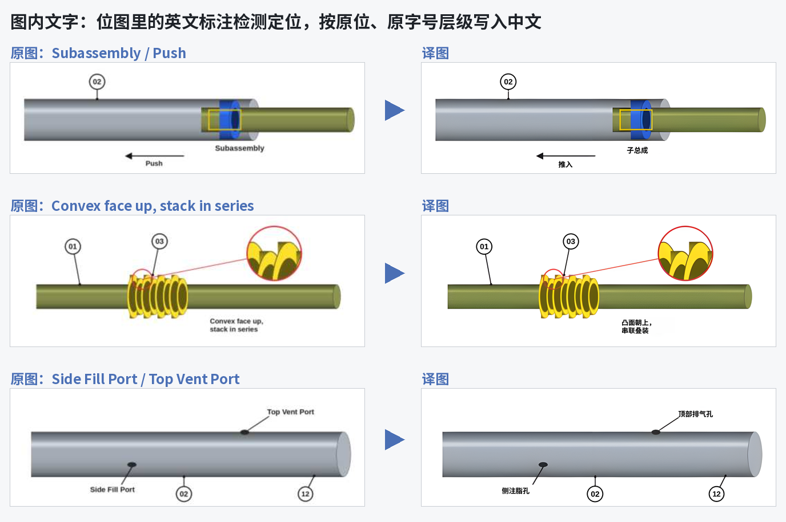

**目录页码自动更新、点击跳转；章节和每个工序都有书签**

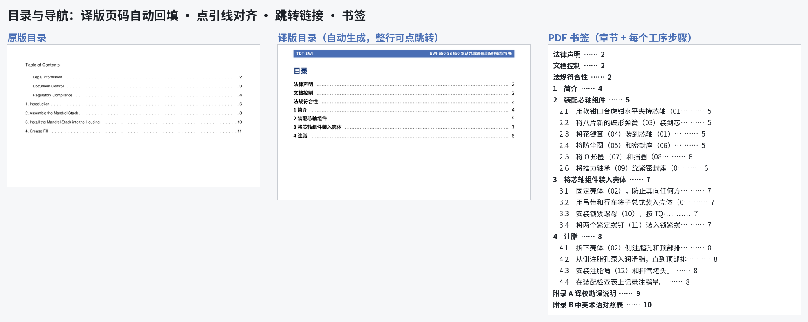

**正文后附《译校勘误说明》与《中英术语对照表》，各自另起一页**

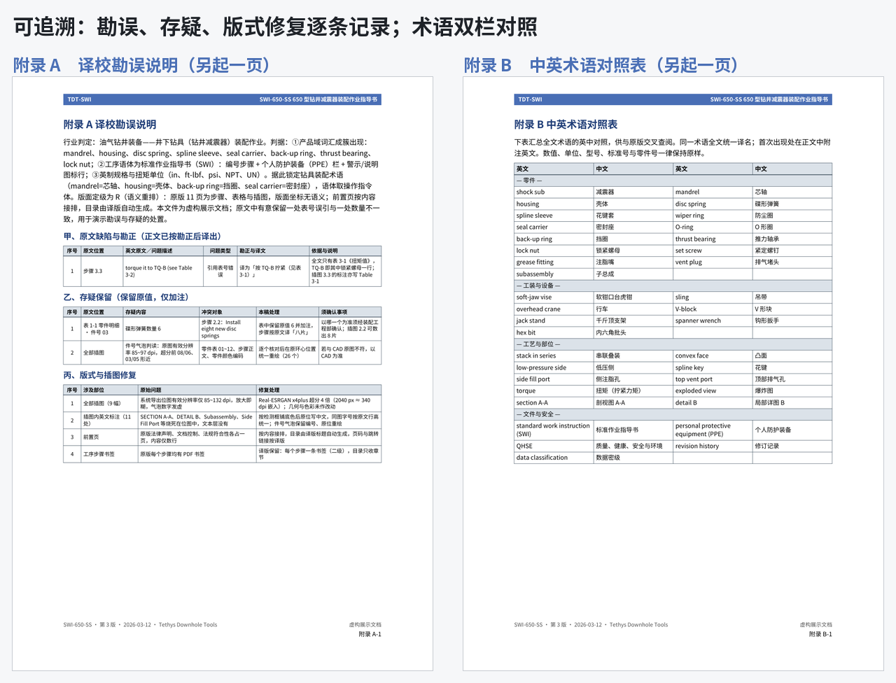

<details>
<summary>全册缩览</summary>

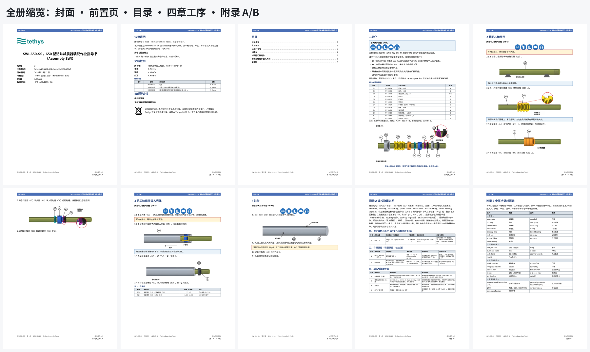

</details>

### 工程图纸：原位换字

📄 原图 [TDT-650-0100_Assembly_en.pdf](docs/showcase/TDT-650-0100_Assembly_en.pdf) · 译图 [TDT-650-0100_Assembly_zh.pdf](docs/showcase/TDT-650-0100_Assembly_zh.pdf) · 复现步骤 [examples/showcase-dwg](examples/showcase-dwg/)

**只换字，不动线：剖面线、尺寸线、件号与引线原样保留，扭矩值、螺纹代号不变**

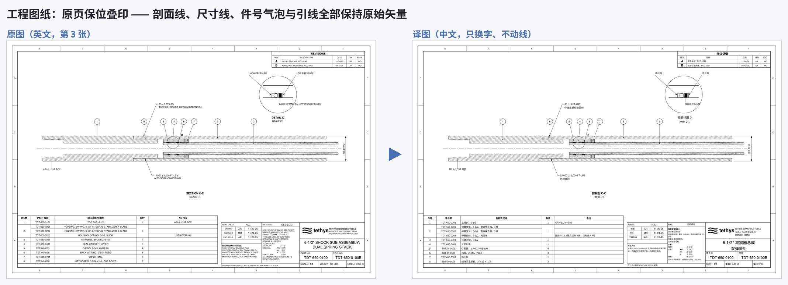

**标题栏注记、明细表（合并格保留、错引件号勘正）、引线标注、竖排尺寸**

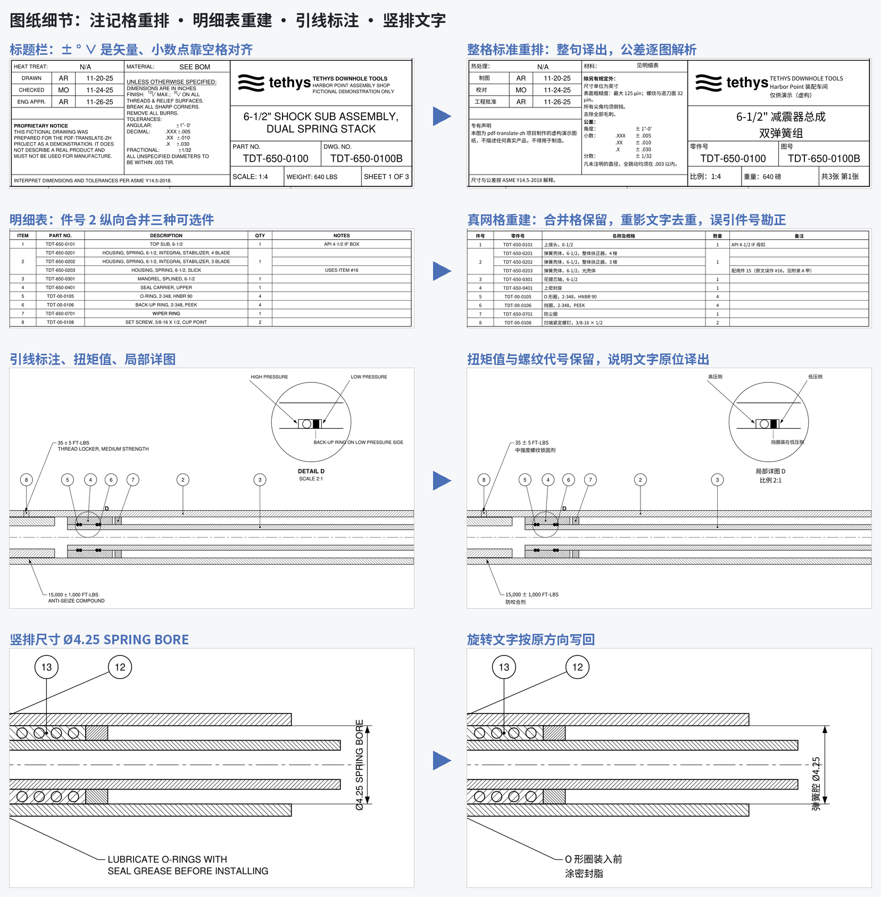

## 它怎么工作

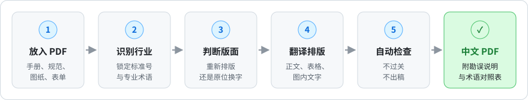

**不同文档，不同处理**


## 出稿前自动检查


> [!NOTE]
> 自动检查能拦住漏译、乱码、数字出错这类问题，但拦不住措辞和术语选择。**任何模型的译稿都须人工审校**，重点看附录里的术语对照表与勘误说明。

## 怎么用

装好后，在 AI 工具里直接说：

- 「把 `C:\docs\pump_manual.pdf` 翻译成中文版」
- 「把这份图纸汉化，保持原版式」
- "Translate this drilling specification PDF into Chinese"

你会得到 `<原名>_中文_v01.pdf`，正文之后附《译校勘误说明》和《中英术语对照表》。

## 安装

任选一种，装好后**重启 AI 工具**。首次使用时会自动配好依赖和中文字体，不用手动安装。

**Claude Code**（插件市场）：

```text
/plugin marketplace add ldfpku/pdf-translate-zh
/plugin install pdf-translate-zh@pdf-translate-zh
```

**其他 AI 工具**（需要 Node.js 18+，一条命令装给多个工具）：

```bash
npx skills add ldfpku/pdf-translate-zh -g
```

**Claude.ai / Claude 桌面版**：从 [Releases](https://github.com/ldfpku/pdf-translate-zh/releases) 下载 `pdf-translate-zh.zip`，在 **设置 → Capabilities（功能）→ Skills** 上传并启用。

<details>
<summary>更多安装方式：npx 参数、安装脚本、手动复制</summary>

### npx skills 常用参数

```bash
npx skills add ldfpku/pdf-translate-zh -g                          # 交互选择要装到哪些工具
npx skills add ldfpku/pdf-translate-zh -g -a claude-code -y        # 只装给 Claude Code
npx skills add ldfpku/pdf-translate-zh -g -a claude-code cursor codex --copy -y
```

去掉 `-g` 则装到当前项目；`--copy` 复制文件而不是建符号链接（Windows 上推荐）。Claude Code 插件以后更新用 `/plugin marketplace update pdf-translate-zh`。

### 安装脚本

**macOS / Linux：**

```bash
curl -fsSL https://raw.githubusercontent.com/ldfpku/pdf-translate-zh/main/install.sh | sh -s -- --agent claude
```

**Windows（PowerShell）：**

```powershell
irm https://raw.githubusercontent.com/ldfpku/pdf-translate-zh/main/install.ps1 | iex
# 需要带参数时：
& ([scriptblock]::Create((irm https://raw.githubusercontent.com/ldfpku/pdf-translate-zh/main/install.ps1))) -Agent claude
```

克隆仓库后也可以本地运行，参数更多：

| macOS / Linux | Windows | 作用 |
|---|---|---|
| `sh install.sh` | `.\install.ps1` | 自动检测本机装过的 AI 工具，全部装上（都没有则装给 Claude） |
| `--agent claude` | `-Agent claude` | 只装给某个工具：`claude codex cursor copilot gemini antigravity opencode windsurf agents all` |
| `--project .` | `-Project .` | 装到当前项目（`.claude/skills` 与 `.agents/skills`） |
| `--link` | `-Link` | 用符号链接 / 目录联接，改仓库立即生效（开发用） |
| `--bootstrap` | `-Bootstrap` | 装完顺手配好 Python 依赖与字体（不加也行，首次使用会自动配） |
| `--uninstall` | `-Uninstall` | 卸载 |

> Windows 若提示禁止运行脚本，用 `powershell -ExecutionPolicy Bypass -File install.ps1 …`。

### Claude.ai zip 包

也可以本地运行 `python tools/package.py` 生成到 `dist/`。该环境里依赖需要能访问 PyPI 或国内镜像；网络受限时见下文「自定义镜像与开关」。

### 手动复制

把 `skills/pdf-translate-zh/` 整个目录复制到对应工具的技能目录：

| 工具 | 全局目录 | 项目目录 |
|---|---|---|
| Claude Code | `~/.claude/skills/` | `.claude/skills/` |
| Codex | `~/.codex/skills/`（新版也读 `~/.agents/skills/`） | `.agents/skills/` |
| Cursor | `~/.cursor/skills/` | `.agents/skills/` 或 `.cursor/skills/` |
| GitHub Copilot | `~/.copilot/skills/` | `.github/skills/` 或 `.agents/skills/` |
| Gemini CLI | `~/.gemini/skills/` | `.gemini/skills/` 或 `.agents/skills/` |
| Google Antigravity（IDE / 2.0） | `~/.gemini/config/skills/` | `.agents/skills/` |
| Antigravity CLI（`agy`） | `~/.gemini/antigravity-cli/skills/` | `.agents/skills/` |
| OpenCode | `~/.config/opencode/skills/` | `.opencode/skills/` 或 `.agents/skills/` |
| Windsurf | `~/.codeium/windsurf/skills/` | `.windsurf/skills/` |
| 通用 | `~/.agents/skills/` | `.agents/skills/` |

Windows 下 `~` 即 `C:\Users\<用户名>`。各工具的目录约定在更新，以其官方文档为准；拿不准时用 `npx skills` 安装最省事。

</details>

## 本地模型方案（敏感文档推荐）

技能本身不绑定模型，翻译由 AI 工具当前连接的模型完成。把工具接到**本机或内网部署的模型**，整条链路就不经过任何公有云。

**Claude Code + Ollama**（Ollama v0.14 起可直接驱动 Claude Code）：

```bash
ollama pull qwen3:30b            # 示例：选中文能力强、支持工具调用的模型
ollama launch claude             # 一条命令启动（交互选择模型）
```

**其他工具**：Codex 用 `ollama launch codex` 或 `codex --oss`；OpenCode、Cursor 等在各自配置里添加 Ollama / LM Studio / vLLM 提供的本地 OpenAI 兼容地址。

<details>
<summary>手动指向本地服务，以及注意事项</summary>

macOS / Linux：

```bash
export ANTHROPIC_BASE_URL=http://localhost:11434
export ANTHROPIC_AUTH_TOKEN=ollama
export ANTHROPIC_API_KEY=""
export CLAUDE_CODE_DISABLE_NONESSENTIAL_TRAFFIC=1   # 关掉遥测、错误上报、自动更新等非必要外联
claude --model qwen3:30b
```

Windows PowerShell：

```powershell
$env:ANTHROPIC_BASE_URL = "http://localhost:11434"
$env:ANTHROPIC_AUTH_TOKEN = "ollama"
$env:ANTHROPIC_API_KEY = ""
$env:CLAUDE_CODE_DISABLE_NONESSENTIAL_TRAFFIC = "1"
claude --model qwen3:30b
```

**注意事项**

- **确认模型真在本地**：Ollama 里名字带 `:cloud` 的模型运行在 Ollama 云端，不是本地；只用 `ollama list` 里已下载的本地模型。
- **关掉会外联的功能**：本地模式下工具自带的联网搜索、网页抓取等仍可能把内容发出去，处理敏感文档时关闭它们。
- **上下文窗口**：建议 ≥ 64k（Ollama 的默认值可能不够，在设置里或用环境变量 `OLLAMA_CONTEXT_LENGTH` 调大），否则长文档会被截断。
- **模型选择**：优先中文能力强、工具调用稳定的模型（如 Qwen3 系列）；显存 24 GB 级别的显卡可运行 30B 级量化模型（上下文开大会多占显存）。
- **质量预期**：本地模型的译文质量与工具调用稳定性通常不及顶级云端模型。自动检查能拦住大部分机械性问题，但**译文仍须人工审校**。
- **完全离线**：首次联网配好依赖后，在 `config.json` 设 `"no_autoinstall": "1"`，之后不再访问 PyPI；超分权重可事先放进 `scripts/models/`。
- **自查**：可以断开外网跑一遍 `python tests/smoke_test.py` 和一份真实文档，确认整条链路离线可用。

</details>

## 运行环境

需要 **Python 3.9+**（Windows / macOS / Linux，x86_64 与 Apple Silicon 均可），其余全部自动配置。

<details>
<summary>自动配置了什么、缓存在哪、自定义镜像与开关</summary>

- 没有 Python 时，`setup.sh` / `setup.ps1` 会尝试用 Homebrew / winget / apt 自动装。
- **Python 依赖**（PyMuPDF、reportlab、Pillow、numpy、fontTools、scipy）装进用户缓存下的私有目录，按 Python 版本和平台分开，不碰系统 Python、无需管理员权限；系统里已有的包直接复用。下载源依次尝试 官方 PyPI → 清华 → 阿里云。
- **中文字体**：优先用系统字体（Windows 微软雅黑/宋体，macOS 苹方，Linux Noto CJK）；后两者首次使用时自动转成 TrueType 缓存（macOS 约 30 秒、Linux 约 2~4 分钟）；一个中文字体都没有时用 PyMuPDF 内置字体兜底（无粗体，建议 `sudo apt install fonts-noto-cjk`）。
- **插图放大（超分）**：只有检测到低清插图时才安装——Apple Silicon 用 MPS 版 torch，NVIDIA 显卡用 CUDA 版，其他用 CPU 版（配置了 `sr_onnx_url` 时改用更轻的 ONNX Runtime）；装不上就退回高质量插值，不影响出稿。

缓存位置：Windows `%LOCALAPPDATA%\pdf-translate-zh\cache`，macOS / Linux `~/.cache/pdf-translate-zh`（可用 `PDF_ZH_CACHE` 改）。

想提前一次配好（可选）：

```bash
sh ~/.claude/skills/pdf-translate-zh/setup.sh          # macOS / Linux；加 --sr 同时装超分
```

```powershell
powershell -ExecutionPolicy Bypass -File $HOME\.claude\skills\pdf-translate-zh\setup.ps1
```

### 自定义镜像与开关

把技能目录里的 `config.example.json` 复制为 `config.json`，保留需要的键即可；它跟着技能目录走，换电脑不必重配。同名环境变量 `PDF_ZH_<键名大写>` 优先。

| 键 | 作用 |
|---|---|
| `pip_index` | 自己的 pip 源，排在默认源之前 |
| `torch_index` | torch 的下载源 |
| `sr_url` / `sr_onnx_url` / `sr_onnx_sha256` | 超分权重的下载地址（内网或自建镜像） |
| `sr_autoinstall` | `0` = 不自动装超分后端 |
| `no_autoinstall` | `1` = 完全不自动装依赖（离线环境自行准备） |
| `no_autofonts` | `1` = 不自动下载字体 |

</details>

## 验证安装

```bash
python tests/smoke_test.py        # Windows：py tests\smoke_test.py
```

全部 PASS 即环境可用。首次运行含依赖安装，约 1–3 分钟；之后约 20 秒。

<details>
<summary>它检查了什么；自带示例</summary>

冒烟测试依次：引擎自检 → 生成虚构样例 PDF → 判断版面 → 说明书示例出稿并过全部检查 → 图纸示例原位换字并过全部检查。

`examples/` 里有两份完整示例（基于虚构文档，由 `tests/gen_testdocs.py` 生成源 PDF）：

- `examples/mud-motor-manual/`：说明书（页眉、术语表、正文重新排版）
- `examples/stator-drawing/`：工程图纸（原位换字、白名单、字典）

流程细节见 [`skills/pdf-translate-zh/SKILL.md`](skills/pdf-translate-zh/SKILL.md)。

</details>

## 已验证的模型

除三平台 CI 外，下列「模型 + AI 工具」组合做过端到端验证。**盲测**：AI 只拿到英文 PDF 和一句需求，自己走完全程，再由独立评分脚本复核（方法见 [`tests/agent_eval/`](tests/agent_eval/)）；**开发验证**：用于编写本技能的模型，以[效果展示](#效果展示)两份样例为准全程实跑。

| 模型 | AI 工具 | 平台 | 日期 | 技能版本 | 结果 |
|---|---|---|---|---|---|
| Claude Opus 5.5 `claude-opus-5-5` | Claude Cowork（桌面应用，云端会话） | Linux 云端沙箱 · Python 3.11 | 2026-09-24 | 1.1.0 | ✅ 开发验证（非盲测）：效果展示两份样例检查全过，干净目录重跑一致；冒烟测试通过 |
| Gemini 3.8 Flash（Medium）`gemini-3.8-flash-medium` | Antigravity CLI `agy` 1.2.9（无人值守 `-p` 模式） | Windows 11 · Python 3.14 | 2026-09-24 | 1.0.2 | ✅ 盲测通过：说明书 + 图纸各 1 份，约 7 分钟；检查全过、重跑可复现、附录各自另起一页、无抄袭 |

<details>
<summary>人工复核发现的问题（已补进行业惯例）</summary>

复核 Gemini 那次译稿发现（已据此补进 `references/industry.md`）：API 螺纹类型死译（IF 译「内部平整」、FH 译「全孔」，应为内平扣、贯眼扣）；标题栏 APPROVED 译「审核」（应为「批准」）、SHEET 1 OF 1 译「第 1/1 页」（应为「共 1 张 第 1 张」）；公司名半译；一条勘误说明与正文不一致。

</details>

欢迎按 `tests/agent_eval/` 的流程提交其他模型的验证结果。

## 仓库结构

```text
.claude-plugin/          Claude Code 插件与市场清单
skills/pdf-translate-zh/ 技能本体（SKILL.md、references/、scripts/、setup.*）
examples/                完整示例（虚构文档），含效果展示 showcase-swi/、showcase-dwg/
docs/showcase/           效果展示用的对比图与原文/译稿 PDF
docs/infographics/       README 信息图
tests/                   样例生成、冒烟测试、AI 端到端验证（agent_eval/）
tools/package.py         打包 dist/pdf-translate-zh.zip
install.sh / install.ps1 多工具安装脚本
```

## 参与贡献

见 [CONTRIBUTING.md](CONTRIBUTING.md)。改动技能后请跑 `python tests/smoke_test.py`，并同步 `SKILL.md`、`.claude-plugin/plugin.json`、`.claude-plugin/marketplace.json` 三处版本号。

## 许可

[Apache-2.0](LICENSE)。运行时按需下载的第三方组件（PyMuPDF 为 AGPL-3.0/商业双许可，Real-ESRGAN 权重为 BSD-3-Clause 等）不随本仓库分发，见 [NOTICE](NOTICE)。
